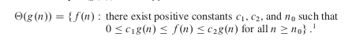
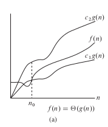
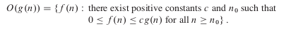
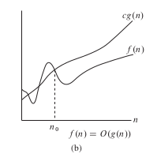
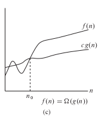
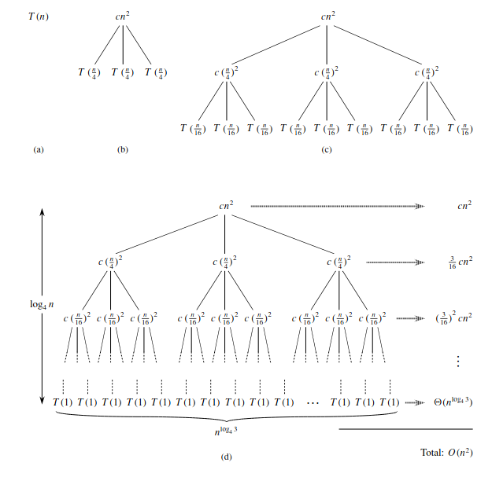

## Introduction to Algorithms

Este documento son apuntes tomados del libro del titulo y sera para conceptos interesantes.

## Conceptos mencionados

- Algoritmos
- Structura de datos
- NP-Complete

## Tipos de problemas a resolver
1. Problemas de Ordenamiento

# Crecimiento de funciones
El crecimiento de una funcion esta visto a partir del tamaño de la entrada que le pasamos a dicha funcion. Ya que con tamaños pequeños es muy superficial y invariante de lo que puede reflejar una entrada mucho mas grande. Cuando hablamos de crecimiento en las funciones, nos referimos mas particularmente es a la asintota de dicha funcion, la cual lo que proyecta es el tiempo de ejecucion de la funcion a partir de la entrada y el limite que tenga. Normalmente es mucho mas eficiente para todas las entradas, exepto para las mas pequeñas.

## Notacion Asintotica
Es la que se encarga de describir el tiempo de ejecuion de un algoritmo asintotico. Donde su dominio son los naturales y este se utiliza para calcular el peor caso T(n) . En este normalmente a parecen **Dos limites Asintoticos** uno superior y otro inferior, los cuales ayudan y dependiendo decuales existan podemos usar alguna de las siguientes notaciones.

### Notacion $\theta(n)$.

Esta es la que se utiliza normalmente para definir el peor caso. 

 

  

Como vimos en la imagen esta lo que nos dice es que normalmente es la funcion medio que encontramos cuando graficamos con respecto a la funcion multiplicada por una costante cn en un limite superior e inferior.

## Notacion O(n)(big 0).

  

Cuando solo tenemos el limite asintotico superior
es decir tenemos cn multiplicado por la funcion como limite superior. Podemos encontrar esta notacion

## Notacion $\Omega$(n).

Cuando solo tenemos el limite asintocio inferior, nosotros podemos utilizar esta notacion para encontrar la funcion .

## Teorema 

si tenemos una funcion f(n) y g(n). Teniendo que f(n) = $\theta(g(n))$ si y solo si f(n) = O(n)=(g(n)) y  f(n) = $\Omega(n)=(g(n))$.

Lo cual es logico porque al final de cuentas la unica diferencia cuando aplicamos cada una de estas notaciones es que encontramos f(n) dependiendo de los limites que tenemos.

## Notacion asintotica en ecuaciones y inecuaciones

Cuando ya tenemos conocimiento de las notaciones lo que podemos hacer es utilizarlas como funciones anonimas o equivalentes para simplificar.Es decir
f(n)= 2n²+3n+1 y decimos que n = O(n²) eso quiere decir que $ O(n²) \in \theta(n) $. Con esto lo que podemos decir es que 
$\theta(n) = 3n+1$ y asi simplificar la formula tal que
f(n) = 2n²+ $\theta(n)$ y finalmente concluir que es $\theta(n²)$.

# Recurrencia

En esta parte vamos a hablar sobre la recurrencia pero mas que nada de los metodos matematicos que existen para saber cual es su tiempo de ejecucion. Para esto hablameros de el metodo de sustitucion, arboles, maestro.

El tiempo de ejecucion de un metodo ecuerrente es una equacion o inecuacion. La cual va depender principalmente del tamaño de elementos en la entrada que le pasamos. Donde decimos que para valores muy pequeños n T(n) = n o T(1).

## Metodo por sustitucion

Este es un metodo que se basa en dos pasos:
1. Adivinar la forma de solucion
2. Usando induccion matematica encontrar las constantes y mostrar que la solucion funciona.

Este mentodo en el libro esta planteado o visto desde un punto de vista que no es el que vamos a tener aca. Mas que nada porque el del libro es mucho mas resumido y por ende no termino de convencerme.

El metodo de sustitucion que vamos a ver va ser basado en el [video](https://www.youtube.com/watch?v=VHGisohk3Ck). El cual explica de otra manera como abordar este tipo de solucion.

### Ejemplo

Vamos a hacer un ejemplo de como entrar la forma de resolver un tiempo de recursion usando metodo de sustitucion.

T(n) = {1 n = 1}
T(n) = {2T(n/2)+n para otros casos}

1. Lo que hacemos es coger el t(n) y decir que n = n/2. Valor que toma el n en caso que no es igual a 1.

n = n/2
T(n/2) = T(n) => 2T(n/2/2) + n/2

Equacion 1:

$t(n/2) = 2T(n/4) + n/2$

2. Ahora hacemos que t(n/2) = t(n/4)
n/2 = n/4

T(n/4) = 2T(n/4/2) + n/4/2 

Equacion 2:

$T(n/4) = 2T(n/8) + n/4$

3. Digamos que para este caso no hace falta hacer mas casos. Pero de verlo necesario que es despues de este paso. En el cual encontramos un patron, si todavia no es tan evidente podemos seguir buscando mas ecuaciones.

Ahora lo que hacemos es empezar desde T(n) y remplazar las formulas.

Donde T(n) = 2T(n/2)+n y T(n/2) = 2T(n/4) + n/2. Entonces

T(n) = 2(2T(n/4)+n/2)+n => 2²T(n/2²)+n+n

$T(n) = $  2²T(n/2²)+2n $

Remplazamos ahora con t(n/4) en esta formula

2²(2T(n/8)+ n/4)+2n = 2³T(n/2³) + n+2n

$2³T(n/2³) + 3n $

4. Como podemos ver se empieza a ver un patron y es que :

$ 2^kT(n/2^k) + kn $

Este es un patron de comportamiento que vemos en cada una de las iteraciones.

5. Ahora lo que decimos es que a partir de nuestra primera hipotesis verdadera que dice que n = 1, entonces t(1) = 1. Donde podemos decir que

$ n/2^k =  => 2^k = n => k = log_2n => k = lgn$

Donde tenemos encuenta

$2^k = n$ y $k = lgn$

6. Ahora teniendo despejado k, lo que vamos hacer es calcular nuestro caso base que es cuando T(1) usando la ecuacion de K.

 2^kT(1) + kn  => 2^k + kn 

 Donde si nos acordamos $2^k = n y k  = lg n $

$n + nlogn$

Diciendo finalmente que 
$O(nlogn)$

Asi mas o menos funciona el metodo por sustitucion.

## Metodo de arbol recurrente

Este metodo es un metodo mucho mas organico de entender y a encontrar una respuesta mas rapidamente que con el metodo de sustitucion. La cuestion esque este metodo normalmente despues de usarlo. Se utiliza el de sustitucion para comprobar si esta bien.

### Ejemplo

Arbol de recurcion T(n) = 3T(n/4)+cn²

Donde cn² es la raiz del arbol y las diviciones son sencillamente las veces que se realizan por iteracion el metodo, que es el numero acompañado por el T(n), en este caso es 3 de 3T(n/4). Segidamente cada ves que se hace se ejecuta la recurrencia T(n/4). Luego lo que pasa es que colocamos el valor que nos da cn² cuando n = n/4 y por ende tenemos que c(n/4)² y asi sucesivamente hasta llegar a T(1). Donde decimos que su profundidad es $log_4n$ debido a que lo que hacemos es combinar o multiplicar cada raiz en cada espacio y lo que vemos esque entre mas apliemos la raiz obtenemos que $4^k$ por ende eso es iguala $log_4n$ y la parte que esta a mano derechoa es la convinacion de todos los valores o suma .

## Metodo Maestro 

El metodo maestro es el mas sencillo de utilizar. Ya que unicamente esta basado en un teorema,el ccual cuenta con las siguientes 3 condciones. Entonces tenemos su tiempo de ejecucion.
Donde su forma base es : 

$T(n) = aT(n/b)+f(n)$

### Teorema

$a\ge 1 $ y $ b > 1$ 
donde f(n) es una funcion y T(n) esta definida por una recuerrencia no negativa.

1. f(n) = 0($n^log_ba-e$) , donde e > 0 y T(n) = ($n^(log_ba)$)

2. f(n) = $\theta(n^(log_ba))$ , T(n) = ($n^(log_ba)lgn$)
3. f(n) = $\Omega(n^(log_ba+e))$ , donde e > 0 y $cf(n) \geq af(n/b) $  para alguna constante c <1 y lo suficiente grande a n, donde T(n) = $\Theta(f(n))$

