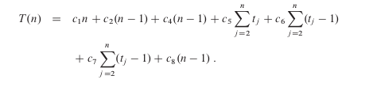
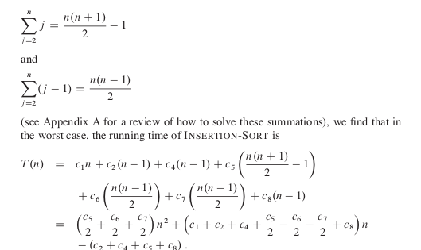

## INSERTION SORT

Es un tipo de algoritmo de ordenamiento el cual esta basado en el conceto de bucle invariante.(Este esta explicado en el readme general de este topico).

Lo que hace que este algoritmo cumpla con las condiciones de este tipo de algoritmo es devido a que en un principio lo que estamos creando es un sub arreglo del arreglo principal. Donde decimos que si tenemos un arreglo A nuestro invariante es un subArreglo con J = 2 donde [1..j-1] donde cada elemento de este es A[i] pero organizado.
Como siempre nuestro sub arreglo va estar ordenado con los elementos del Arreglo A, se cumple la condicion 2 de invariante.

## Problema que resuelve
A partir de una secuencia de numeros n .

Hacer una permutacion de secuencia de manera creciente los valores.

## Ejercicios

### 2.1-3 
Considreando el siguiente problema de busqueda:

entrada : una secuencia de n numeros A = {a_1, a_2, .... a_n} y un valor v

Salida : Un indice i el cual v = A[i] or un valor especial null if v no aparece en A.

Escribir un psedocodigo para una busqueda lineal, el cual atra ves de una secuenta busque a v. Usando un ciclo invariante, probando que su argumento es correcto. Este seguro que su ciclo invariente cumple con las tres propiedades

### Mi Solucion

        for i = 1 to A.lengh
            A[i] == v then
                return i
    return null    

#### Problema mi solucion
No estamos aplicando ninguno de las propiedades del metodo invariante. NO ESTAMOS DEFINIENDO LA INVARIANTE!!!

### [Solucion Solucionario](https://sites.math.rutgers.edu/~ajl213/CLRS/Ch2.pdf)  
        i = NIL
        for j = 1 to A.lengh do
            if A[j] = v then
                i = j
                return i
            end if
        end for
        return i   

### Explicacion de la solucion

Primeramente debemos saber que el invariante para este caso es K . Donde se cumple la condicion de inicializacion ya que uno de los posibles valores de retorno es nil, entonces se cumple la condicion de que es verdadero antes de entrar en el ciclo. Cuando entramos al ciclo se sigue cumpliendo ya que aunque la condicion que tenemos no se cumple hasta un j especifico. K sigue siendo nill y cumpliendo alguno de los dos valores de retorno de salida. Donde si A[j] = v, entonces decimos que i = j y lo retornamos. Dando como respuesta que v pertenece a A.

### Costo de tiempo de ejecucion

![imagen](data:image/png;base64,iVBORw0KGgoAAAANSUhEUgAAAUcAAACaCAMAAAANQHocAAACJVBMVEX///8AAAD///36//////v5//////nw+/////f///NIYnP1///9/v/rzrTy/////PL//+zCwcHW1tbf3995eHjIyMji7fmBgICeg1XUuaFpYGXL3/K0zd7/8dkpUoOUudFta2umx+dxgapAY3t8VVXUso9kYmJ5ZkZCSGTm1cJXWYRncYZYZGnw5cn19fXt7OyddE99mLGMiouYbDqXgGcAACo4Njb+6smampoAADGpqamPqso+LC8pAAAAABITAAAAGV1WU1SHZ1G2kGkAAF3jw6SwlXouLDLJ6P3049NZUUrX2+S1xt/w5t7D0+bFro0AACA0AAAAABcAAEnw2bOHWENCLUjYxq0WP2UgAAAkZJZoPgCAcW92h5J/iqlqhaDWycEyTm1+cmNLcInBs6QpAEKDbFSIaV1BMyBHYIJGRUFHJwBtVEcZHj+inKi6wc9plrZAK1soHRSShpw0IAwXJDmRorY2MUJDdJ1bQ0+st7paPj2bc0saO1uZmYlDMwkySFqYlK9BICM+AAONWhUiDxxoa5I/GADHo3p7nMVdPR66nZMnFi0zHFciEjYAB0JZLSZ6WTGFUCRrMCBmYHdIVFFYMAo7RU8sACBIIjYNHUo5OGBZIAAzS4UrABMAD1pvUB5gTC+RY09XBwBrZ4QlADI4OiuplJMAKWkGHTavh3GDWSBNLwBoNzSBbGxiQQAALltXOEMrJCRvXUiyycZjEwCBfW369vORAAAcXElEQVR4nO1dj18TV7a/mYz5AcHJzwkhCQko4DQkITFqDFUUltEhTKIWO7ASEyGLYlF8XQ2KwrJtLSDdWrpWuq3dLt19q9XXPqt9/n3v3plJBDJJCCT82Obrp2nI3Jm5853745xzzzkXgAoqqKCCCiqooILfIDD4n2Zjp+Ie4Ml1qn4P/z+vhiU3dvHdBmLQ6bRu6EzG2eyMKaWPWS7yPGpdSrZuJxJJxUt+SebdXpU+DBR6PQmYkJ5k9XqTif9UAo/eBP+xJngcJELoQy8HLPoLorYRMAcgSWxoHH6sKC8H1IzQTtv6SVAznIPrLQAj+Q6JMKAulv5e7/YCTmYD1AGl+5J+qFfVOaxPNqrOx5KHbd0u3R9MTiv9jpIY8Xkv+wBzJQ7YHr52WO2lMEiQgHYZ6FElIZZP/sHUbAXnHfyluauXSKDY7yh5nXOC1YXRh0mOPvYkPpDqadRYu0dPevVKfVhhIoVzCJ1ps28b8ci+vmYlroO+fiU7DuZuoDfWZQMH21kl8V+AJaONIDoqB/aeiGLow17sj2J9bt5KacCRa7Aqbe18eYdY3j4RQQXsf6Sm4MGu25us4fpBVemOKamTv7Y4FHcm7+69NzUuMX5HD6Wom72Ww8GeA9N/mgdUa7IeC6RGbJu8N8/jeFe/9zogFo/CLjo344dNqis2fQC+Tfa/0J0bQe08AIrLDvWfuXPkdY3HoPfCYyOy+J7ufdUANP1+VXlqiW8H91LRl4jH32+yhuuG/dhphY79qBfM3VZ97NCD5zekSnH1gFk+TXXMN52zftJgvx8J3MA6b7PeTd5c4BHrrAoBD7Dcd6D2SJGgKziL+mOGx0YAVJfb1X8GcxOfAq65uUEBKY8et3bvgzPK3O1V5QUeu+M6+uGW8jiH7hQdrQbn24HlnFV7MiJVqs0BuO9A7T7w5bz24d7nE8ZeoGE6GjZ7c4FHwD7wgYXToCuOeAQLe7ts1Gewqdv/AngeuRklYK5aIY+KthP8ecRdEhw5Y9V+bgXqMQfs1zWZ8ny/Jh4pgf3hlvZryCMbjsLXPGO4Ds6nmJ7r1dmFtCeD5D2f/gub9iHZXaUbgoN+eEFJu+SbuzcxJJsJB+A4BqewpqngHSvzYMY/1M/MXlJGD0VUtMwhZ5ZfRsBCq7+nF0Sv2YD9Hf5EfHHJ/MAnB9ydYE9KTsHyc0cjqgAsD9A8wy727yU6YcdXjG3ZPEMNGF0k9b6/jiTO+u9YLbJ2iULujjj4sh+O3LAn0Wds3PHmWPVfY3d7S1oTTxHHNGkpPPsk96W3b5dzSTSKckEjfmB5n2QVkCIC8E22xnLB4tsjfmMe7UQ5fNdAnxbHfit6YQUVVFBBBeuG17BeoQHPURBLK1mYtIHSs26pZPcAT76z+gfm7ldVayfZmriUgMWdPJniv7DhNQd84he6Vcriwi1JKmy7G+z0idU/dB1NTKzlkUlJtCtmSU+fQ4yox1YbS7SP06ogdWBv1mkJpX3pP1EYcp9Y9Sd7/lBKQ5nNEXUwZDIKBPFmvSzAVqjtQfrUoqw1wj41jqfbbOBKmkekW7M60qMnWd4wGJYTyauk5VOvaY/EBTcPCtmU80Nh0uG6cvSHNTwS54/bqGPt0UNWWrZ0UyCEmhXNIZTRaDabjcZ0+2NOon670JFix+qZAbE31/jm0jxesAHaRfuoP8V6rimZnvFFl/fxvnBtbFC2sbWMAuCqdF9nd4A1iF7zL5fDdLKGR9B2aE+X7LS7IxU93itqI+zfxNqxJgHpeeQeTx3XYasZuKH6YoovRTy2tYmmMvs3ZE2/4UEvM9tIfauB7H7iAF/asCffEV+Xo2czfydVOjkw5FeWo7LTXZKGyU0ii8ej1W2y01SHD/Io/tSUNiGyOgEiC1GhBSIeO9rVX0zwyiCd0o08E45bhvHFKr8VNE3tgVXnXPQl0v6N8sghZXdZbJJN9egzOZG3SWLn51Xvl6M3uL9f/Xfb8b1NsoY+WcNbHtvSpi/KL0AYLrkqL4sWGbgBR/TmbdXsKP8j5LYJ8siOAyzgu/6PBpDYe68d/BS0dn87rgSWqnE6Dp7HCo5jG8BcPRqz1UN5ebQvWd1L46UfntkR2arJmJmVjXoDM2PDxLLskmBt0N6RHJepDpmMN/FRAzKH5bOhKfSWqWNxQD2Q9YK59/Yo7k2Fu245U9oJq3p2VN757zMp8PxQuKUBH/mxHP3afcwYIwGRn0fL6J5u2ZaZRFdIypiGOlBgMQ3XrJC901grKdHtwP1SpA/bdAWlgWpNjBWcarYF7PtDJXl9Fpc+6tsCeylXt9mlv/IAT5RmLMMSOlNJLlRBBQWBpYfDcg19Ox4GfR4hwJtYx8SqV4KEk/eY8WrAZdduVJ6xAsJ7Yfyw1NGfezrmZKcLXkELlRNLI/9NFgHqurKofOUFtbxvk/49fXGNXZZ7gut7WfAKeOCcVeQRtcft5XGjo0pN1SZ5ZOH5/8zNY5cv6Y+AhNnvT4EAXwzziEgX4YJ/F3kkhmJ7tpVHbNr8r0Kaivqp0zCU5SCwaR4hjkzlvIa6LjzUC7riVH/y8700L0YyVw8jfJj2xLS71B3pfh1oBNvJI1Z7I2NRyQ3u0MXaLHtPCXi09+SeGJgrx0+DmjOhuoj6dSQp7XZUNQ3HBZ5HxQvbtvJY8x6qRNKY37rY9VLO+2dq755EGOUJ3DyPanMEeHN1Bm60pQELVJm8GiwQi/FTGjPkRGgWu0b3RS/7T5FH+3/v3VYekb+ZhkpR3+TjRH3XoT2A7CyYVwAvsG2ex7apoP9fuVxwDjq6Z6YHh710BHQfF5qtQi9A+Mt+QANUZx0Cj7w1bDt5fKZJIp+30XwyDLVE1vw7a7mp+9ImeWT8fr8555M/JfGfbVoj6ilNUko2ETRbFdN+P8nzGECrXtvIIzHtHEeRA3kFWCoFqFjW+pPZn9oSVyk28ce894E86tkexOB2y4/Eft/TnSvBfjKav91b7l+svcVbxy/f2t6nYHW68R3qhVfBtmKDYWK7FWyBtWTmIsB50dEDhYQClyKBvZkfxD1yLFnHr+IkpJa++WCgdQDXb18QU5HodD7IO/Zhbc8AM4CkxeTNKUmLbkZDVP2jARxB8QsAuwBPaOP1yE/Sa5wrXX08RL4l5ExJReeu8bywtwP7e/kqS910gFpessU7eV0QPST/pPzTYsCSEYiisjSPvNou8IjWbpD5gHWBTFenbShUhD8g/uIBb48Sren3qqGu7hYeMYBZGvONZLVTJDPLz8Sqzrhi4dF0nQMkzXUkM+hMEU+dQ8aPlsRWSrn49liNBLlP0zyybxyMMzYY94z8GPNMO51ogKDOVkWi+94020BikP9BsWCOkeqAs87KmI3NPT/GlEmj04rR5p5d0x4BQcsO5KmsXdYOum7xBSCPgDsTmXumXTrNGTptnKy3dkoX7hTbo2KQfCHyCJr2yUUe8XvzqgtxduB0Xz2gb4NuGbrUeRuIviRr6+1T3ucoxIb5ZS9H1l4E0W/0y8Mhrl/ed8nzw7PoKOB2D4+YhpjNsx5IvyS1x+b5r4hH9wngfgYCshT7RTAYJLlRAH4Qz6a/Cn4wL/CIBdB4KvTr2nkA6X1h66tHkTTEBeQphHish8q7ZSkYvA5bLtFydNwDj2hl4eft4Ei/nG4NBlMvHEiJK/PjlxIHc/Noh106elTUrDM8GpIy193TQBFewSPj8rItIo/EMpLF3/Jo43kEnb4VPH6HeISFkQuRh6U7xl+0Ix7pdtDXD7qG4YjwjxuQx90yX9v9YeZk7pc+JyOJx3Fh/FR0DgP3e6D7e5VLM+dqmdGNNMBWBX6I61CT6jwNsMVGgUfmc2QFFHlsBBca8CcNfSd0gZd7mWuImPO+cXhmtN4ui+nQzaFoddDRVb+3b0rZNg/6HuqSsliyin4YoV9tYdDxpkAMGmO5A660y3HQl16ioc3mUNA8GTRHnhpjSjjP9NrN5nFAORFfSeM4nH7MVn6+jvJCDc8jZfaHzMGkOegZSsmTTsFCwBl1frPJb45QTiP6gZg2ppRgwekiOXgJ9VCwGpVULBj9wXWJmTsemEEJe28xZ0AeWe9+viW2ZS9X/GYXZYvGEVls4Vwctkk8OrAz/UMqqKCCUsHjLSJmpqjCvx1wcKD8qysC2GybOnt97U+KpA1Qy761BdcFyp+1YrBOJEI7X1AlZqF2s98KqKHvsxR597drha7kgxtQr9wQj8zXJNe/oah56nUJ/ACKhULv1QAPlIiAwuD1Yl6NB/6NGzwA83oMGhRXl/7ggdHI+Xl/BMr8WTxiEhFyXRvmses2IBYLJuzAPBJxeaXwpygSxP7JZiv1aPqQ1b4Uavmd9gMH9bGDGAp+lArIWq/cBsnWwDUyGhuqF1sG5zs4L/DozuKRGsgmbMM84j/cgJr6fIFSqsC10M1y+FMUC/ZxL0u+iCU/9gVSoO93SL/+wRYd1bXsc79X3fe9/SSp9us/m6TFUCN7M/kiJ49qITWMR1gSFwT+DfOoGkM8FjzTIuvl42dw8aYl8gMoGlhU5vI++VVvYC/3ZnisvWEweHkjBvUI6tZ9/Xq9GDVLG4P/05izPZ7kq08NGhGEoM+N92u+PUrlSFmFtnrwE9IQ1D/zN3WVyC+laHjDzAPfJz6gnu6Jizyet9GXqsHTBOTxBPNhL0gkYWOs4Z+oJg6ZSfN4Av3CBzaI0Q3RT7OvL/K4gdjiuXpAXCi06mufiNhnwmulhJqqLczqIoC9axqxcR1LV63dsqUrzwB99M3NUfbBraup6PEwfVQZkB2OVdce/+pb9IapWRtg/7efRDx6aJkNNkgK2T1qDvHPK2GxYx7A0pDH5/VF14xYTNEFIwe5A3trOtY2dyJwrRyBUXmBGUxhDabXhQGmD0e/h9N32OAFrCmMGfQGg55U6PVKoEgICexYvQHlNBR4FAYjQge1b4I/rP08W9zjS0Me18Z0rweEyVRwsdcbllghJdLj5HYB9uv1YX+20YIIJkell3zxuY3J4bsWrNm4zoRWC9leicR0rnSmnHHLe1kFFfynIZ+EUcToi+9mh56cmafXD0s8t4OP/W+5hrBv15ykSB7YvWspbMC1eT/72eHcPBKhHPIpuzb1LJG4tnPdNwuBpTetzxCDydw8srnyj7ChLNLUZclWUBwSQakEOaug0oUUoSwhbPN6Ie2o2ZeTR+K8KMgxzTx60tqr/bOsqmi3n8fosL5wvhTLN7GW0tt7qE/l3blj64T8PABZGnno0/qHmMpIyFdh5gttP4/M50qFXlPItTJ6nLyHmoN6kK98rDR2CrqjQ9Yxk8saT91JJ5wJCUgL0xaX4J4npKHhK779PM7xKrnih7zKEP5gXhiBVDqh8rzJYtM8Yh5NnvYYHZ0Uvog8BtM81mabS3cEj4kISE7n5dG9RNZ8lVo7ktVsNt4VXSP3PBOdkY4xw59kcaYInNruyGvmrjGmpFxcXhmGc8lrTq0d3JmxU1uROmMNMM+RlztzeU2Dek4g5zC1w2DvuVPadNulhX23GDlww+7VXCooB3B56Rw3MKAouNeFR4icYcNAjLPNCclUr2/XWuCtFIkgmqQUC5PZY6y3/MMu/tRo5he4nC6lejZ2pXD+jfVBPXTyakEHO+5dJC8q7r00jEy8naklsuZRdUOprB+jBzKzPt0LiBabEtS2A35zmlXAo1k/lQFcR9zLKxUtDsUXprpSZYzjfPrCyUGxJ3wuvahLSR9/yyOTRRlxt1d9N1tjnEjzSHU4II+wCXARoM0Ok6jZtxWrdulHsLv6blNrK8FsdAa9cC6P2LfgTyX9qcR15ZOq6VYbE5yUw0ogL2TUufkdu5DfSVXG9sNNKIV9UtigP6zQTSavk4AJTt8SeVS/fpfnUaG7vkfkUftu6u2kRfv0OhIkJg06YcunopEISu2AtAaqB+lmn7Ayf151CE/ebNyYHIkZklde5qyyRXaDOnab8+FPbk0+3udZ7FfS58KBS4YP0Hop82/h3eGJobpJYQS0HKgW9u154eiux9tuTd5tt5+MUGkeaduY0B6jUP4U26Mn2ewS1+qIRWunzxPwwX+31SMbaBjrslPAih8bznWI+5zcsEGXeJLTt8i+/Cw58HLaij9xgYNVylrI4xnThSXzTaR6MVczswJLL/EecxkeE6bAM3lTHHTdsIwCcb8u4O5P3PUJPMbB234N30MrP0LYzxrHwdxoYsJqP7q3qXgtk/laqTBpCFPBPcuiORNAosyr+PUNUlmbO7iClu2jO4bliicu+aLI46+PLwluntHMNKOATIyjymf6dVecObGnCW2uNJfhkagz6XgXnNPq1w0reGSTJ2N8325a+oxUnW29rgT4i19jxT+HYKegY9cL8cjkNAWgTCp44UXwbLAmJfFLnsQzx+bdHQ1A9WSf/MU+ZRvfrxfP9FIX4a0OCk8PeWiOiT3TPhZRoZVq9cc27nvlHGqP3K0IM8FrGDQ80MbzyCynMv068aY1JQwK2GVHV1zXYVWFlIDeiHGdt1No4TBRoJyqJTNmUOmpkliAQzmwL4WsIJotcRRGjazVmee+isXTKL+nZWAieOVW6Mqt1PlXMerm/Ut8lOA+ngicTr19D9zJIZQwA++85f8o9nrGtDyjDEz0nEK/WT5zAMu7M1Y15PEjX7o9auvG061H22xl3k0FllA8TnQjGZV5OwXmKZg+lc4YhLCM10YSpe1F+zPKAb2xPc/yx7RopJYMPblPxAr2CV7ugVDnCA9FF1AbN5abVYNUBlVdfh450XOIuL6HuGNVPDX7/WbYYZrmhQsQdTszL+xaEC0+RKAimVPoVt/N2uBh/WCMBXzEmSs23vExsewDWlc1bkKJvMOASe8YV4a9X8sCzMCLhrgpp2cSZiijWoNdPnX4FMKrayTyLRR5ZF6Ph/i7FkrrVYEE6MxslgiFBBEeq4ScFAtiuuAqbQXrAW7w5ktqu1XI7XosFc+x6qimYKFyAbnX8+uE+rBG/dhVhN2sQNvFExvwNsSDJKA+uyiX8FtRJHqB/bUr13t+SgL7YSOp0pHsSPGuyyVAl6wqiGAesGnfNzxafZD7l7SZQpGMwBk9nzxFXB4uYJqVgmUG8vgOFCLSflSKkCh1KRautEPxPheP7nNWYG9VAmKoF7i3hUeiRcyrzF3svuFenY2NgjXDDNnn4EmUw4MazXPZro1EkmlnpwQeMz5/qsGM9BrIw6NiUeQRnVgGHnNmBF0B94CQ/hHXsyS7uiu+aEAbWUidhCICFJ25g0rsspnXRa87Ky7rlngeqdm00Kowp3nEV/BIiPvVvLWH/3qW55Fd/q4MPDI9/kPrUEaikhsRQxw5Cp/qbKuUAMlHVvDpdKRRczRCXCh2myWLjxL6teoyr/ErDAZ2MGww8Is4K3lk/WYEY1rzp1zaDqE9drWXnkfiQS9hhr3LW8AUi3X+KG0F6UZm0TtWcZ0IF3yahAztPI/duTOt1/ST/BbmxcA+Zh76JoJ4ZIQcxVSd03m41dksJOLK3a+xsdgbmQ3xqP4lUnoeu0+gT+JNqqDdLEfGIsQT7+ljQU2S4RMBO4XZpRCPWjheRfMmlM1GwAq0E1bEI/c2xZw/8y5W8MiM8UmyX4nWmzk4/Pwfz+ORKqgVlprHrt8DzKteLpyqhm5Mf6PSph92sNUK+k4oAR33AiaU1QoK8QhJ1C8XpVHi0UtKzCJLIR7nbqV7rCozPjLLw2SaR0zDQ3C+xriHJEbJ4hrIo+WVr/TtkTtkemOtORDKl2eML5dxLkOrQHzSZk8y3BQH2gESHFyyQQln7Snsk9twYqTjeSQbcblq3UChWgrk7wZ5ZDMpVFVv0jyyJhMp2a8VehOJQxlYieYZlDup1Dziickw4D4FB/PbgO3vizwb5Ko6q+qpPxj0wxGpCXYjOGonYEexrG3SmAE9lJAmq+Sg3lkxrK7eMAPjcsrhEPZW4UGocsiPxFAwv8+8olNcGI4OA7tLruD9EcOAQhuWECM8UwFpvhbKsV0fbHhDOdco3c58aaQJM59Fih0sS/QbVkCtoGXIbjZxqgOl4W8X07EruSshM4lsu9WASEpn2KJ2i//VlgDTpxH2eAOZkZTV69N6DBHaJX5/OwXEQqWFlQoVA+QGgSfFkIHQpJKoCzaXqg/zIl7xZ0n/LLG0uOMcoKOyOL8kE5q1gSeTP6/Wx4msvEwiMA9g8o0C2oFXp2SNeQpInyW973LfwzVvl5hex/5eWww8IOZXdX965DazWmYnXlsluzqWHIAiJZ0np43F4fEsFp9gUDo/ukK/5m3i7IWt5XE9CSbtHwhBHpjH0uBenTsdWU+YixKX9SK9kBjLLYdD8rVFBx8wfskFIsqc1fKJreUxab64DlMBJ8shuCK9MLH8MqfdjM67tN1U/ML383TYYc/Kzbrw7KRYW8oj1hVfx/5cAC0tSPdAZKdQ/SJ5rKCdAihaivZnITKniHvHiV5SZ4WsRq38xlO8BWNLeaQeVuNeIhQMFpqDmY+keUQ8uVH0TXKF3eziuuxmKzatXz+YzD73gp3WLNiX+wR92SOYP3mj7pbyyPvtUZOmPPmnBdRm+nVmDsbQbsDIjmtxycXtMdJ2XL6RFOaxqVhrOLpeSBiGCCHUUSdmJmvNdhjPDqArH+ZeAn5/LomJYhWiw5lB9K2/WazlBrDDmbzW5QDuR1lWlheoqTTljrAGYKH42ZprlXzjC1mGFuKpcwuDDokhIzKPzBUYp9zfCtVU6eREnRVPokXYiAd0w0H+ywZAx0hArV2/wZJOYwQoRgomT/sPQiG/O6LFBjRwSCcCcaA2KnFx9zviZxKtH/EU09JNiypy3WB3gy1gfGiTpWFFRkfBjhshAhGTB0XDopTd0jvOMdsdz7uz4PG83aH2bcOzGM28yRT+aHdKh0oUdpH9jYKYNkvOv2XkC8udJyjPoZ2OUtacDfkLLBe64SxVW2UDVHY5NkSChStS8yMb3Mkh2llgJYJGiwL+0zg7m1fGU6HUvbWQq7m0oJmJwWOGTsGhNyDFI3NlN7kHU683m59Ce98KPskrQUaRVl+LiqR7QU1GjEL+FLg0j+9vi9e/Z12SSfaMsfk8SLW33tzIN0y4Y8jKAXmkz6SbrTSPrJDHRSdUKHo7ergXX3BefX2gurZo++YGwfaYjxZ6feqRH8uS99rd0zGf7yUOhgMCj5RwK6/Ba/F5Ra1zJY9Jo5D/WBCyzk/+HMYCceov2juRmi3KLkos9hLGarzAuit33CHkvV6pPm+aR/wnGyfLo0hZqvxXhvcgHqNCq6Kbm3smnM0CXTn7tfYmvKhb5nxkBW0Oyxbp2N3fww+1P+TLS2Q677V2P59qrER5r7XvkaArt72ceQS1c6jWQx5fONI+o0ck+3X0FW+LFAIDORc9DObq5cALmqpiW6RO8X5S9lZD3ngubXnyXmPnfYbcflLsWDtgR6ZIyKP6n5kgq8z4qEje783wiK20RXbN2792Jc9MDvYC9/2tMp11HzW9iQD6VV5rAjezt+bDtZZrgv5xs+IFocvjJ8XqUJZoUxjyiOkyxTI8EjrTuByT6tcsCRJhDPktAW7Lci/jyOXL7mLv5GuPLHyi8bUF4By5NXmvV4VoE6vX2CTlnjQS01vVq0XYByedO26tN4OkM6eMueDM1yWSvq1+qMpmShVUUEEFFVRQQQUV7Ej8P+F2Zyw7nPkqAAAAAElFTkSuQmCC)

El tiempo de ejecucion de este algoritmo va depender del tamaño del valor de entrada que le ingresemos, ya que este nos dira cuanto se va demorar en recorrer. No es lo mismo ordenar un arreglo de 3 elementos a uno de 100 elementos.

La imagen de arriba muestra los costos en si del algoritmo donde decimos que el costo esta representado por una constante Ci y el tiempo de ejecucion esta ligrado al tamaño del arreglo donde n = A.length .

Donde en el for nosotros decimos que es c1 n. Debido a que este se ejecuta de acuerdo al tamaño del arreglo que le pasamos y las siguientes instrucciones son n -1, ya que en la ultima iteracion del for no entra. Seguidamente mas abajo cuando se define el ciclo while tenemos que tener encuenta que este esta condicionado por la variable de iteracion como tal que es j, donde decimos que el while se ejecuta en tl ya que este va es a depender de las veces que j se ejecute por el tipo de instrucciones y donde lo de adentro es tj - 1 siguiendo el mismo ejemplo de las instrucciones despues del for.

### Mejor Caso

En el caso en el que suceda el mejor caso significaria que el arreglo esta ordenado por ende no entraria al while pero si se ejecutaria donde tendriamos que c5 se ejecutaria n-1, ya que no entra en el while por las condiciones e de igual manera se ignorarian dichos tiempo de ejecucion dentro de este.

### Peor Caso  

El peor caso es en el que todos los numeros esten desordenados y por ende se tiene que ejecutar todo el algoritmo las n veces. Donde lo que se muestra aqui es la suma de todos los costos y sus sumatorias en notacion desglozada. Cuando tenemos el peor caso al simplificar y analizar la funcion que nos da nos damos cuenta que lo que tenemos es una funcion cuadratica ya que nos queda n2.

#### NOTA   
El tipo de algoritmo que es el insert sort es el de acercamiento incremental.
