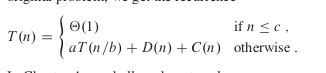
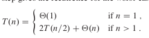
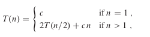

# Divide y venceras

Existen unos tipos de algoritmos conocidos como divide y venceras. Los cuales de lo que se trata es de crear subproblemas del problema original y solucionarlos, donde finalmente se juntan todas las subsoluciones para llegar a la solucion real. Este metodo lo que busca es minimizar el tamaño del problema en subproblemas y que sea posible solucionarlo de manera mas sencilla. Este metodo esta basado en pasos de recursion, los cuales son llamados a el mismo algoritmo.

## Pasos de recursion 
Este algoritmo cuenta con que suceden solamente 3 pasos a seguir :

**Divide**: Es dividir el problema en subproblemas

**Conquer**: Los problemas se resuelven de manera recursiva. Si un problema es muy grande pero facil de resolver

**Combine** La solucion de los subproblemas es la solucion del problema principal 

# Merge Sort

Este es un algoritmo de ordenamiento de suceciones basado en la logica del divide y venceras. En el cual sus pasos se reprecentan de la siguiente manera.

**Divide** divide la secuencia en n/2 ordenada. 
Donde n es la cantidad de elementos de la secuencia principal.

**conquer** llama la funcion merge-Sort de manera recursiva

**combine** combina las subsecuencias ordenando la secuencia original.

## Merge

Dentro del merge sort nosotros utilizamos una funcion auxiliar llamada merge (combinar). La cual lo que se encarga es de ordenar los subsecuencias que vamos sacando.

Donde esta se define como merge(A,q,p,r), donde A es el arreglo a ordenar y q,p,r son indices numericos. Donde p $\leq$ q $<$ r. Donde decimos que, A[p..r], y donde q lo que viene siendo es la mitad del arreglo (n/2). Donde se generan dentro del merge un arreglo1 = [p..q] y arreglo2 = [q+1..r]. Diciendo que estos son los rango de valores que tomarian. El tiempo de ejecucion para este algoritmo es de On = r-p+1 . Donde esto parte de manejar un sentinela que es un caracter especial .

## Merge Sort 

Ahora la funcion de merge-Sort, es una funcion que se llama a ella misma dos veces donde se pasa merge-sort(A,p,r), Donde estos parametros se refieren a los mismos del merge, donde en este caso se tiene una condicion y es que p $\ge$ r, eso quiere decir que el arreglo es de un solo elemento y por ende no toca ordenarlo. 

### Tiempo de ejecucion (Induccion Matematica)

Para el tiempo de ejecucion en el merge-sort como tal tenemos la siguiente induccion.

donde: 

**aT(n/b)** : division del problema en subproblemas.
Donde a normalmente es 2.

**D(n)** : tiempo de dividir los subproblemas

**C(n)** : combinacion de los subproblemas para llegar al original 

Donde luego de ver que D(n) y C(n) son constentes, lo que decimos esque estas dos son igual a cn. Dando asi una nueva hipotesis

Mirando el arbol generado y teniendo encuenta que este se encuentra expecificado para que n sean potencias de 2, podemos deducir que 2/n n = 2n Donde si n = 1, entonces  log21 = 0, 0 + 1 = 1. (Explicacion mas detallada en el libro).

Ahora bien esto lo podemos simplificar a que T(n) = nlog2n

