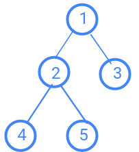

# Arboles binarios

Los arboles binarios son aquellos que cuentan con dos hijos maximos por cada padre. Donde los hijos son representados como hijo derecho y hijo izquierdo y el primer nodo es conocido como el nodo raiz. Cuando un nodo no tiene nodos hijos se le concidera como hoja.

Un arbol binario puede ser representado en un arreglo, donde este guarda su informacion de izquierda a derecha por profundidad. Esto lo veremos mas ejemplificado abajo cuando hablemos de cuando es complete o full.

Segun lo visto anteriormente cuando tenemos un arbol representado en un arreglo este se puede evidenciar deacuerdo a las siguientes operaciones:

- i = es el indice de un nodo
- 2*i = hijo izquierdo del nodo
- (2*i)+1 = hijo derecho del nodo
- |_i/2_| = padre de un hijo

## Arbol binario Full

Un arbol binario full es aquel arbol que es un arbol binario y tambien es completo. Donde en su maxima profundidad tiene para todas sus raices el mismo numero de hijos.

## Arbol binario completo

Un arbol binario completo. Es aquel arbol que no tiene en su definicion de arreglo espacios vacios, es decir, que tiene del lado izquierdo de su ramificacion mayor cantidad de nodos que en la derecha.

### Ejemplo

La manera mas facil de saber si un arbol es completo o no es haciendo su representacion en un arreglo y es porque para guardar un arbol binario en un arreglo se hace de acuerdo a la profundidad y de izquierda a derecha. Siendo el anterior arbol representado tal que [1,2,3,4,5]. 

Donde si utilizamos las operaciones para ver si verdaderamente esta bien armado. tenemos que 3 esta en la posicion 3.

i = 3 
padre de 3 = |3/2| = 1

Donde 1 es la posicion del padre de 3, el cual es correcto y si ahora miramos sus hijos

izquierdo = 2*3 = 6
derecho  = 2*3 +1 = 7

Si miramos en el arreglo el 3 no tiene hijos, pero si los tubiera serian las dos siguientes posiciones a llenar en el arreglo.

Si miramos el anterior arbol si entendimos correctamente como funcionan los arboles completos sabemos entonces que este no lo es.
Debido a que si hacemos su representacion seria tal que [1,2,3,4,-,-,5] y no [1,2,3,4,5] ya que si hacemos las operaciones.

si queremos saber el padre de 5 entonces, si usamos el orden sin dejar espacios 5 estaria en la posicion 5 donde obtenemos lo siguiente.

padre(5) = |5/2| = 2

Donde el indice 2 es igual a el 2, pero 5 no es hijo de 2. Si lo miramos con el que tiene espacios 5 es 7

padre (5) = |7/2| = 3

Ahora nos dice que es 3, en este caso es correcto. 

La cuestion es que los completos no deben de tener posiciones con espacios dentro de sus arreglos, esto sucede cuando tenemos hijos en un nodo derecho y no en un izquierdo completo.

Para este otro caso pasa lo mismo no esta completo su lado izquierdo donde su reprecentacion en arreglo es tal que
[1,2,3,-,5] y por ende no se puede decir que es completo.

